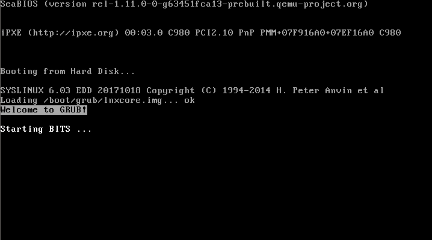
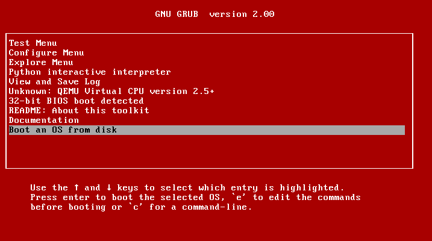
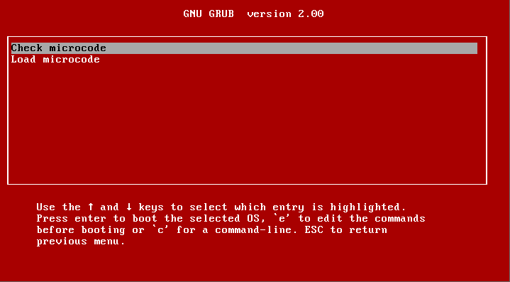

# AUTO BIOS Implementation Test Suite (BITS)
## Modified to automatically load microcode before OS boot

The reason for the existance of this fork is that manufacturers often do not support older motherboards/BIOS with updates.
This leads to vulnerabilities like Meltdown/Spectre not getting patched while the microcode *is* available.
This fork can be used to automatically load microcode before loading OS (using GRUB). By default it will try to boot from the first drive.
I have successfullly tested it by booting from USB stick with Windows 10 (and Linux). It should work with other Windows versions and OS'es too.



_"Boot an OS from disk" loads after 2 seconds, unless a menu entry is selected_



_"Configure Menu" (microcode can also be autoloaded, see **Auto Boot** below)_



### Notes:
- Microsoft apparently includes microcode updates now in Windows 10 for certain CPU's, this is ofcourse the preferred way to load microcode.
- [VMware CPU Microcode Update Driver](https://labs.vmware.com/flings/vmware-cpu-microcode-update-driver) will not be able to accomplish the same as BITS since it loads microcode much later in the boot process; as driver within the OS itself.
- As you probably know, but just to be sure: Linux already does this by itself (e.g. [Debian](https://wiki.debian.org/Microcode) and [CentOS](https://git.centos.org/summary/rpms!microcode_ctl.git))

### Instructions:
- Note that this repo does not include "/efi" dir (get it [here](https://biosbits.org/downloads) or from [Intel](https://downloadcenter.intel.com/download/19763))
- Write to USB stick according to original instructions ([INSTALL.txt](INSTALL.txt))
- Copy this repo to /boot
- You also need microcode from Intel which goes to /boot/mcu/microcode.dat (Google "latest Linux Processor Microcode Data File")
- Optionally; if you put the data file in /boot/mcu.first that file will be loaded first (see [microcode.txt](Documentation/microcode.txt))

### Idea from:
https://superuser.com/questions/1092286/how-to-update-cpus-microcode-with-grub-and-chainload-windows-10
https://forums.guru3d.com/threads/windows-how-to-get-latest-cpu-microcode-without-modding-the-bios.418806/page-2

### Original version and documentation:
- https://github.com/biosbits/bits
- https://biosbits.org
- [INSTALL.txt](INSTALL.txt)
- [README.txt](README.txt)
- [Documentation](Documentation)

The last 2 entries in the menu use:
- AIO Boot to boot Windows (https://www.aioboot.com/en/boot-windows-grub2/)
- Sample GRUB script to autodetect operating systems

### Changed from original:
- automatically load microcode ([auto.cfg](cfg/auto.cfg))
- auto detect OS using various methods and boot it ([boot_ext.cfg](cfg/boot_ext.cfg))

## Auto Boot:

First microcode is loaded and then OS is booted:

* [toplevel.cfg](toplevel.cfg) includes:
  * [auto.cfg](cfg/auto.cfg) which loads microcode ```mcu_load /boot/mcu.first /boot/mcu```
  * [boot.cfg](cfg/boot.cfg) which loads ```menuentry "Boot first drive MBR"``` and includes [boot_ext.cfg](cfg/boot_ext.cfg)

If your OS is not on the first drive try one of the other menu entries. If you have found an entry that works you can permanently change ```default``` in [boot_ext.cfg](cfg/boot_ext.cfg) (top).

The menu entries you can choose from are:

* Generic (BIOS/MBR):
  * "Boot first drive MBR"
  * "Boot second drive MBR"
  * "Boot first drive MBR, Extended partition"

* Linux (EFI, BIOS/MBR):
  * "Linux (autodetect: /etc/passwd)"
  * "Linux (seperate "/boot" on Extended partition)"
  * "Load another configfile (autodetect: grub.cfg)"
  * "Chainload MBR from file "linux.bin"

* Windows (EFI, BIOS/MBR):
  * "Microsoft Windows Vista/7/8/10 bootmgr (MBR)"
  * "Microsoft Windows NT/2000/XP ntldr (MBR)"
  * "Microsoft Windows UEFI"
  * "Windows (aioboot)"

* Other: BSD/ISOLINUX/DOS (BIOS/MBR):
  * Last menuentry (osdetect)
